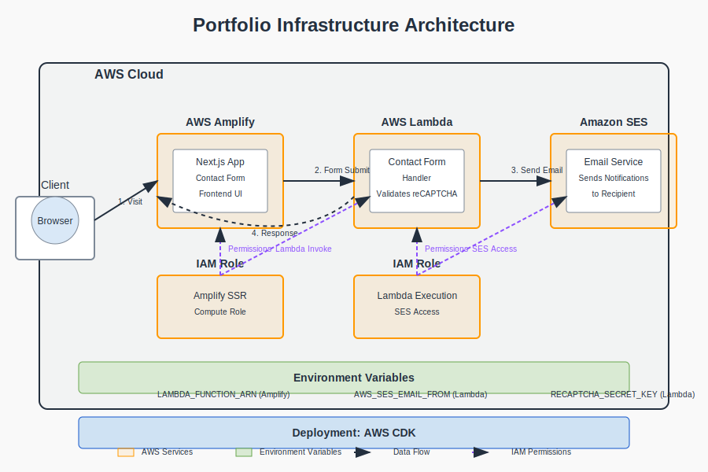

# Portfolio Infrastructure

This repository contains the AWS CDK infrastructure code for deploying a modern portfolio website with a serverless contact form system. The infrastructure follows AWS Well-Architected Framework principles to ensure security, reliability, and cost optimization.

## Architecture Overview

The portfolio infrastructure consists of the following components:

- **AWS Amplify**: Hosts the Next.js portfolio website with CI/CD pipeline
- **Lambda Function**: Processes contact form submissions directly from the Next.js frontend
- **Amazon SES**: Sends email notifications for new contact submissions
- **IAM**: Manages permissions between services

## Architecture Diagram



## Prerequisites

- AWS CLI configured with appropriate permissions
- Node.js (v18.x or later)
- AWS CDK Toolkit installed (`npm install -g aws-cdk`)
- TypeScript knowledge

## Project Structure

```
portfolio-infrastructure/
├── bin/                    # CDK app entry point
├── lib/                    # Stack definitions
├── test/                   # Unit tests
├── lambda/                 # Lambda function code
│   ├── contact-form-handler.ts   # Lambda function implementation
│   ├── deploy.sh           # Script for initial Lambda deployment
│   ├── test-lambda.sh      # Script for testing the Lambda function
│   └── view-logs.sh        # Script for viewing Lambda logs
├── buildspec.yml           # AWS Amplify build configuration
├── cdk.json                # CDK configuration
└── package.json            # Dependencies
```

## AWS Services Configuration

### AWS Amplify

This project uses an existing Amplify app to host the Next.js portfolio website. The build process is configured to:
- Install dependencies
- Set up environment variables including the Lambda function ARN
- Build the Next.js app
- Export static files to the `out` directory

### Lambda Function

The contact form handler Lambda function:
- Processes form submissions from the portfolio website
- Validates form data with reCAPTCHA 
- Sends email notifications using Amazon SES
- Returns success/failure responses to the client

Required environment variables:
- `AWS_SES_EMAIL_FROM`: Verified SES sender email
- `AWS_SES_EMAIL_TO`: Recipient email for notifications
- `RECAPTCHA_SECRET_KEY`: reCAPTCHA verification secret

### IAM Configuration

The Lambda function uses a dedicated IAM role with:
- `AmazonSESFullAccess` policy for sending emails
- `AWSLambdaBasicExecutionRole` for CloudWatch logging
- Permissions allowing Amplify to invoke the Lambda function

## Deployment Instructions

### CDK Infrastructure Deployment

1. Clone the repository
2. Install dependencies:
   ```
   npm install
   ```
3. Build the TypeScript:
   ```
   npm run build
   ```
4. Deploy the stack:
   ```
   npx cdk deploy
   ```

### Lambda Function Deployment

For initial deployment of the Lambda function:

1. Navigate to the lambda directory:
   ```
   cd lambda
   ```
2. Run the deployment script:
   ```
   ./deploy.sh
   ```
3. When prompted, provide:
   - SES sender email (must be verified in SES)
   - SES recipient email
   - reCAPTCHA secret key

## Integration with Next.js Frontend

The Next.js application uses environment variables to connect with the Lambda function:
- `LAMBDA_FUNCTION_ARN`: The ARN of the deployed Lambda function
- The frontend uses the AWS SDK to directly invoke the Lambda function

## Testing and Troubleshooting

### Testing the Lambda Function

Use the provided test script:
```
cd lambda
./test-lambda.sh
```

### Viewing Lambda Logs

Use the provided script:
```
cd lambda
./view-logs.sh
```

### Common Issues

1. **Email not sending**: 
   - Ensure SES sender email is verified
   - Check if your AWS account is still in SES sandbox mode

2. **Lambda permissions**:
   - Verify the Lambda role has the correct policies attached
   - For Amplify SSR to invoke Lambda, ensure the Amplify compute role has `lambda:InvokeFunction` permission
   - Check CloudWatch logs for permission errors

3. **reCAPTCHA verification**:
   - Confirm the reCAPTCHA secret key is correct
   - Ensure proper integration in the frontend

## Environment Variables

### CDK Infrastructure
- `LAMBDA_FUNCTION_ARN`: ARN of the contact form Lambda function (passed to Amplify build)

### Lambda Function
- `AWS_SES_EMAIL_FROM`: Verified SES sender email
- `AWS_SES_EMAIL_TO`: Recipient email for notifications
- `RECAPTCHA_SECRET_KEY`: reCAPTCHA verification secret

## Useful Commands

- `npm run build` - Compile TypeScript to JavaScript
- `npm run watch` - Watch for changes and compile
- `npm run test` - Perform Jest unit tests
- `npx cdk deploy` - Deploy stack to your AWS account/region
- `npx cdk diff` - Compare deployed stack with current state
- `npx cdk synth` - Emit the synthesized CloudFormation template