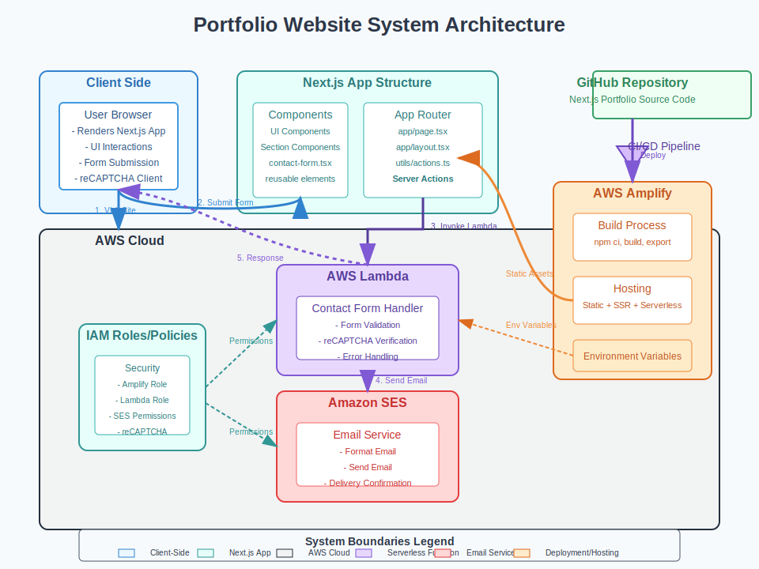

# Portfolio Website

A modern, responsive portfolio website built with Next.js, React, and AWS serverless infrastructure.

[](https://nextjs.org)
[](https://reactjs.org)
[](https://www.typescriptlang.org)
[](https://tailwindcss.com)
[](https://aws.amazon.com)

## Table of Contents

- [Overview](#overview)
- [Tech Stack](#tech-stack)
- [Features](#features)
- [Project Structure](#project-structure)
- [Getting Started](#getting-started)
  - [Prerequisites](#prerequisites)
  - [Installation](#installation)
  - [Environment Variables](#environment-variables)
- [Deployment](#deployment)
- [Infrastructure](#infrastructure)
- [System Architecture](#system-architecture)
- [Contact](#contact)

## Overview

This website serves as my professional portfolio, showcasing my development projects, skills, and experiences. It features a responsive design with dark/light mode, interactive UI components, and a serverless contact form powered by AWS Lambda and SES.

## Tech Stack

### Frontend

- **Framework**: Next.js 15.1.3
- **UI Library**: React 18.2.0
- **Type Safety**: TypeScript 5
- **Styling**:
  - TailwindCSS 3.4.1
  - Shadcn UI components (built on Radix UI)
  - CSS Animations (tailwindcss-animate)
- **Theme Management**: next-themes
- **Form Handling**:
  - react-hook-form 7.54.2
  - zod 3.24.2 (validation)
  - @hookform/resolvers 4.1.0
- **UI Components**:
  - Radix UI primitives
  - sonner (toast notifications)
  - lucide-react (icons)
  - react-rough-notation (highlighting effects)
- **Security**: react-google-recaptcha 3.1.0

### Backend

- **AWS Services**:
  - AWS Amplify (hosting/deployment)
  - AWS Lambda (serverless functions)
  - AWS SES (email service)
- **AWS SDK**:
  - @aws-sdk/client-lambda
  - @aws-sdk/client-ses
  - @aws-sdk/credential-providers

## Features

- **Responsive Design**: Mobile-first approach with adaptive layouts
- **Theme Switching**: Dark/light mode with system preference detection
- **Interactive UI**: Modern animations and transitions
- **Project Showcase**: Portfolio of development projects with tech stack tags
- **Contact Form**: Serverless form processing with validation and reCAPTCHA
- **Certifications Display**: Professional certifications section
- **Testimonials**: Social proof from colleagues and clients
- **AWS Integration**: Serverless backend for form processing

## Project Structure

```
portfolio/
├── app/                # Next.js App Router
│   ├── api/            # API routes
│   ├── layout.tsx      # Root layout
│   └── page.tsx        # Main page
├── components/         # UI components
│   ├── ui/             # Reusable UI components
│   ├── hero.tsx        # Hero section
│   ├── about.tsx       # About section
│   ├── projects.tsx    # Projects section
│   ├── tech-stack.tsx  # Tech stack section
│   ├── experience.tsx  # Experience section
│   ├── contact-form.tsx # Contact form
│   └── ...
├── lib/                # Utility libraries
├── public/             # Static assets
│   └── images/         # Images and icons
└── utils/              # Utility functions
    └── actions.ts      # Server actions
```

## Getting Started

### Prerequisites

- Node.js 18.17.0 or later
- npm or yarn
- AWS account (for backend functionality)

### Installation

1. Clone the repository

   ```bash
   git clone https://github.com/simoncheam/portfolio.git
   cd portfolio
   ```

2. Install dependencies

   ```bash
   npm ci
   ```

3. Start the development server

   ```bash
   npm run dev
   ```

4. Open [http://localhost:3000](http://localhost:3000) with your browser

### Environment Variables

Create a `.env.local` file with the following variables:

```
AWS_REGION=us-east-1
LAMBDA_FUNCTION_ARN=arn:aws:lambda:[region]:[account]:function:[function-name]
AWS_ACCESS_KEY_ID=your-access-key
AWS_SECRET_ACCESS_KEY=your-secret-key
NEXT_PUBLIC_RECAPTCHA_SITE_KEY=your-recaptcha-site-key
```

## Deployment

This project is configured for deployment using AWS Amplify:

1. The CI/CD pipeline is configured in `amplify.yml`
2. Environment variables are injected during the build process
3. Runtime configuration for AWS credentials is handled by `amplify-runtime-config.sh`

The deployment process:

1. Push changes to the main branch
2. AWS Amplify automatically builds the Next.js application
3. Assets are distributed via Amazon CloudFront

## Infrastructure

The backend infrastructure is managed as code using AWS CDK (Cloud Development Kit). The infrastructure is deployed using `cdk deploy`.

The infrastructure includes:

- AWS Lambda function for processing contact form submissions
- AWS SES for sending emails
- IAM roles and policies for secure access
- AWS CloudWatch for monitoring and logging

The infrastructure code is available in a separate branch:

[https://github.com/simoncheam/portfolio/tree/infrastructure](https://github.com/simoncheam/portfolio/tree/infrastructure)

## System Architecture



This diagram illustrates how the Next.js frontend connects with AWS services to create a serverless contact form system.

## Contact

Simon Cheam - [LinkedIn](https://www.linkedin.com/in/simoncheam/) - [GitHub](https://github.com/simoncheam)

<p align="right">(<a href="#top">back to top</a>)</p>
