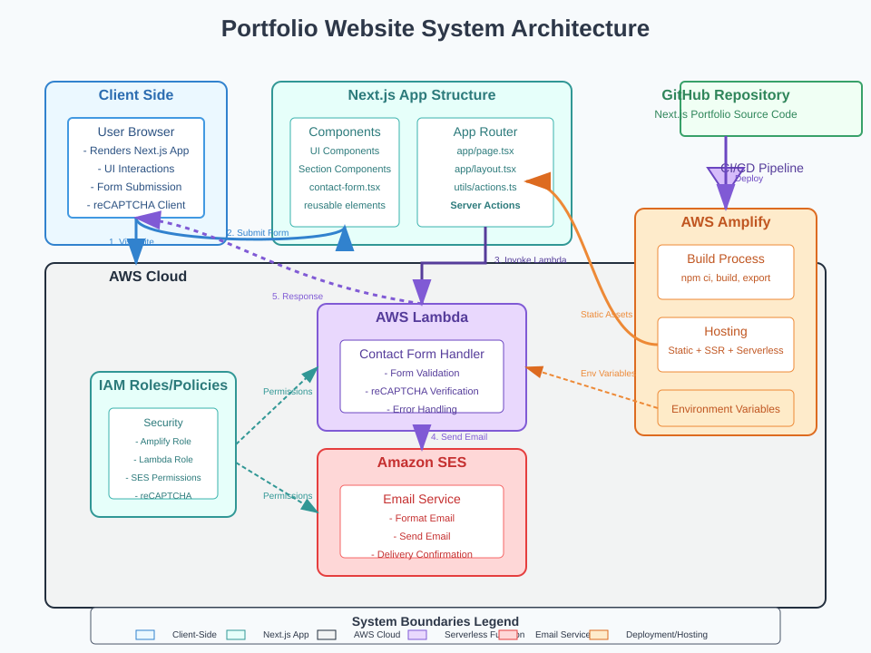

# Portfolio Website

A responsive portfolio site built with Next.js and React, hosted on AWS Amplify, with a serverless contact form that invokes a Lambda function to send email through Amazon SES.

**Status:** Live at [simoncheam.dev](https://www.simoncheam.dev) (verified 2026-09-27).

[](https://nextjs.org)
[](https://reactjs.org)
[](https://www.typescriptlang.org)
[](https://tailwindcss.com)
[](https://aws.amazon.com)

## Table of Contents

- [Overview](#overview)
- [Tech Stack](#tech-stack)
- [Features](#features)
- [Project Structure](#project-structure)
- [Getting Started](#getting-started)
  - [Prerequisites](#prerequisites)
  - [Installation](#installation)
  - [Environment Variables](#environment-variables)
- [Deployment](#deployment)
- [Infrastructure](#infrastructure)
- [System Architecture](#system-architecture)
- [Contact](#contact)

## Overview

This website serves as my professional portfolio, showcasing my development projects, skills, and experiences. It features a responsive design with dark/light mode, interactive UI components, and a serverless contact form powered by AWS Lambda and SES.

## Tech Stack

### Frontend

- **Framework**: Next.js 16.3.0 (App Router, server actions)
- **UI Library**: React 18.2
- **Type Safety**: TypeScript 5
- **Styling**:
  - TailwindCSS 3.4
  - shadcn/ui components (built on Radix UI)
  - CSS animations (tailwindcss-animate)
- **Theme Management**: next-themes
- **Form Handling**:
  - react-hook-form 7.54
  - zod 3.24 (validation)
  - @hookform/resolvers 4.1
- **UI Components**:
  - Radix UI primitives
  - sonner (toast notifications)
  - lucide-react (icons)
  - react-rough-notation (highlighting effects)
- **Bot protection**: react-google-recaptcha 3.1

### Backend

- **AWS Amplify Hosting**: builds and serves the site; runs the Next.js server-side code under an IAM compute role
- **AWS Lambda**: `portfolio-contact-form-handler`, invoked directly by the site's server action (source in `infrastructure/lambda/`)
- **Amazon SES**: called by the Lambda to send the email
- **AWS SDK in the site**: `@aws-sdk/client-lambda` only. SES is called from the Lambda, not from the site.

## Features

- **Responsive Design**: Mobile-first approach with adaptive layouts
- **Theme Switching**: Dark/light mode with system preference detection
- **Interactive UI**: Modern animations and transitions
- **Project Showcase**: Portfolio of development projects with tech stack tags
- **Contact Form**: Serverless form processing with validation and reCAPTCHA
- **Certifications Display**: Professional certifications section
- **Testimonials**: Social proof from colleagues and clients

## Project Structure

```
portfolio/
├── app/                      # Next.js App Router: layout, page, metadata routes
├── components/               # UI components
│   ├── ui/                   # Reusable UI primitives
│   ├── hero.tsx, about.tsx, projects.tsx, tech-stack.tsx, experience.tsx, ...
│   └── contact-form.tsx      # Contact form (calls the server action)
├── lib/                      # Utility libraries
├── public/images/            # Static assets
├── utils/actions.ts          # Server action: invokes the contact-form Lambda
├── infrastructure/lambda/    # Lambda source, deploy record, and test scripts
├── .github/workflows/        # OIDC workflow that redeploys the Lambda
├── amplify.yml               # Amplify build spec
├── proxy.ts                  # Next.js middleware
└── docs/images/              # Architecture diagram
```

## Getting Started

### Prerequisites

- Node.js 22 (Next.js 16 requires 20.9 or later; the Amplify build pins 22)
- npm
- For the contact form locally: an AWS CLI profile whose identity can invoke the contact-form Lambda

### Installation

1. Clone the repository

   ```bash
   git clone https://github.com/simoncheam/portfolio.git
   cd portfolio
   ```

2. Install dependencies

   ```bash
   npm ci
   ```

3. Start the development server

   ```bash
   npm run dev
   ```

4. Open [http://localhost:3000](http://localhost:3000) with your browser

### Environment Variables

The site reads three variables. Create a `.env.local` file for local development:

```
AWS_REGION=us-east-1
LAMBDA_FUNCTION_ARN=arn:aws:lambda:[region]:[account]:function:portfolio-contact-form-handler
NEXT_PUBLIC_RECAPTCHA_SITE_KEY=your-recaptcha-site-key
```

No AWS access keys go in any file. Locally, the AWS SDK uses your CLI credentials. In production, it uses the Amplify compute role.

## Deployment

**Site.** Pushing to `main` triggers an Amplify build from `amplify.yml`:

1. Amplify pins Node 22, runs `npm ci`, writes the non-secret variables (`AWS_REGION`, `LAMBDA_FUNCTION_ARN`) to `.env.production`, and runs `next build`.
2. The `.next` output and `.env.production` are deployed as the artifact.
3. Server-side code runs under `portfolio-amplify-compute-role`, whose only permission is to invoke the contact-form Lambda. No static credentials exist in the build, the artifact, or the runtime.

**Lambda.** Pushing a change under `infrastructure/lambda/` to `main` triggers `.github/workflows/deploy-contact-form-lambda.yml`, which assumes an IAM role through GitHub OIDC, packages `index.js` with its dependencies, and runs `update-function-code`. The role can update this one function's code and nothing else.

## Infrastructure

The backend is small and was created with the AWS CLI, not with infrastructure as code. What exists:

| Resource | Purpose | Created by |
|---|---|---|
| Lambda `portfolio-contact-form-handler` (Node 18) | Verifies the reCAPTCHA token, sends the email via SES | `infrastructure/lambda/deploy.sh`, 2025-03-01 |
| IAM role `portfolio-lambda-execution-role` | The Lambda's execution role (SES send, CloudWatch logs) | same script |
| IAM role `portfolio-amplify-compute-role` | Amplify SSR compute role: invoke the Lambda only | AWS CLI, 2026-09-27 |
| IAM role `portfolio-github-deploy-role` | GitHub OIDC role: update the Lambda's code only | AWS CLI, 2026-09-27 |
| Amplify app | Hosting, build, and the compute role binding | Amplify console |

Logs for both the Lambda and the server-side Next.js code are in CloudWatch. See [`infrastructure/lambda/README.md`](infrastructure/lambda/README.md) for the function's configuration and how to update it.

**Known limitations**

- Not managed as code. The Lambda, its role, and the Amplify settings were created by CLI and console. An earlier CDK attempt is archived at the `archive/infrastructure-2025-03` tag; its only deployed resource has been removed.
- The Lambda runs on `nodejs18.x`, which AWS deprecated in September 2025.
- The Lambda's execution role uses `AmazonSESFullAccess` where a scoped `ses:SendEmail` would do.

**Next steps**

- A CDK stack under `infrastructure/` that imports the existing function and owns the roles and permissions, with the runtime moved to `nodejs22.x`.

## System Architecture



The Next.js frontend submits the form to a server action, which invokes the Lambda under the Amplify compute role; the Lambda verifies reCAPTCHA and sends the email through SES.

## Contact

Simon Cheam - [LinkedIn](https://www.linkedin.com/in/simoncheam/) - [GitHub](https://github.com/simoncheam)
